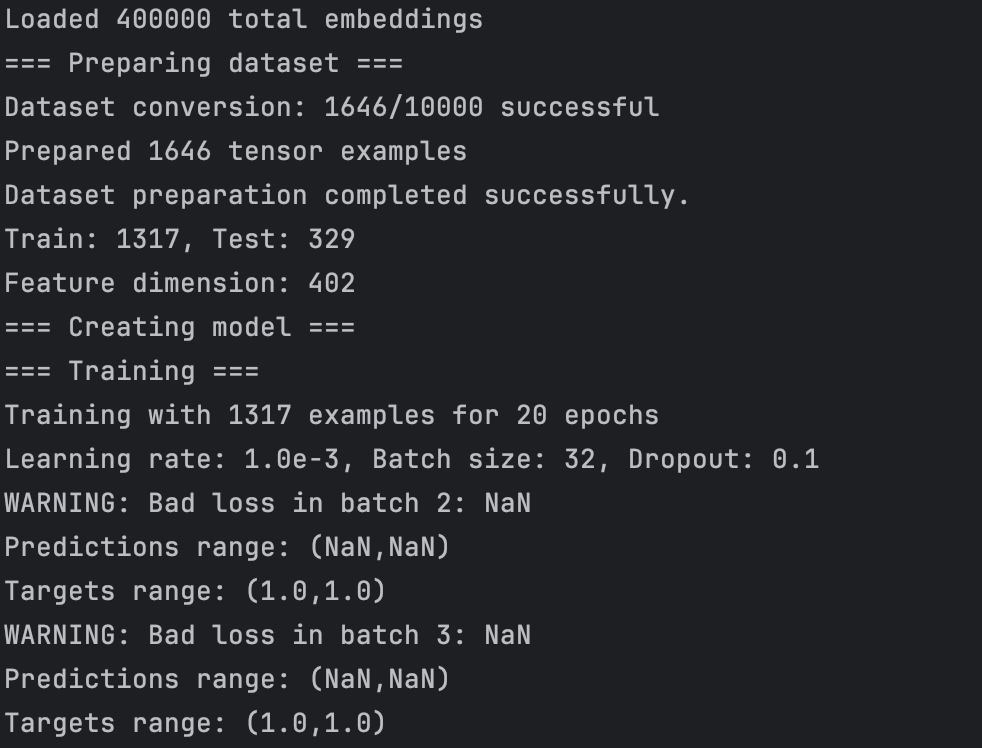
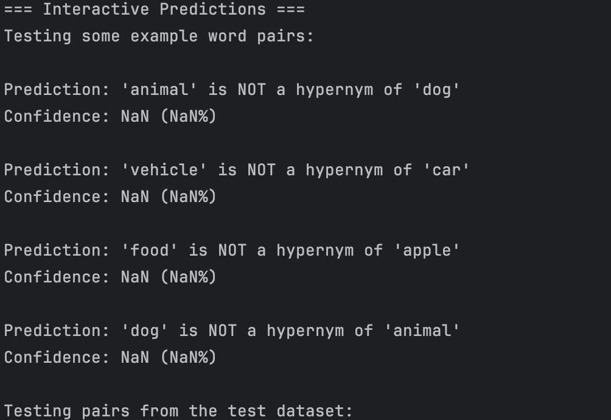

# July 04 2025

## Advancements

[x] (Valentin) Tried to implement MLP with Word2Vec first
[x] (Lyne) Finding the best word embedding model for the MLP model (ELMo is not suitable in our case)
[]  (Valentin) implementing MLP with GLoVE

--

In this week, we tried to implement MLP model for guessing if a word is a hypernym of another. Following what we said 
during last meeting, I tried to implement MLP with ELMo, but quickly realized that this embedding model isn't adapted 
in our case, so I switched to Word2Vec. After trying to implement a code for reading Word2Vec, I realized that my code
took too many memory, which made it crash. I suspect it's because the model is too big and my code wasn't optimized enough.
Lyne searched another word embeddings model, and one we found was GLoVE, so I tried to implement it.

However, when I try to train the model, I only got NaN loss. My suspicion is because I can't find every words from
the dataset into GLoVE's dataset.

I need to investigate further into that, but I don't know if I shoudl focus on that or the hyperbolic task (because if
the word embedding doesn't work with the dataset, I think I will have the same problem when working on the hyperbolic
classifier)

