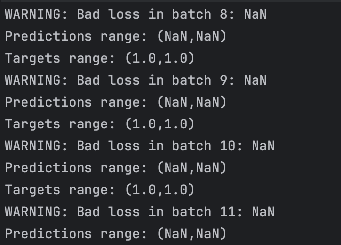
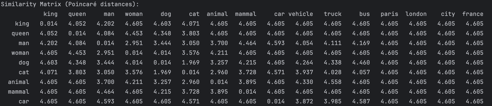

# July 11 2025

## Advancements

- [x] Tried to implement solutions for MLP training
- [x] Started to search a solution for implementing hyperbolic embeddings
- [x] Worked on Poincarré ball implementation with 1D tensor
- [x] (Lyne) Survey on hyperbolic embedding

This week, we started to work on the MLP training by implementing multi-words reading for being able to read more words
on the GLOVE embeddings. Unfortunately, this didn't lead to improvements, we still have many NAN errors

### Hyperbolic embedding

There are different models to represent a hyperbolic space.
For this project we will use the hyperbolic geometry of Poincaré disk.
- https://mathworld.wolfram.com/PoincareHyperbolicDisk.html

#### Poincaré disk

Poincaré embedding is a technique for embedding data (usually hierarchical data into a hyperbolic space, rather than a classic Euclidean space used in most embedding.

First we need to understand the math behind the hyperbolic geometry.
The Poincaré disk is a bidimentionnal model, it seems like we will have to use Riemann curvatur tensor to measure the curves.
- https://en.wikipedia.org/wiki/Riemann_curvature_tensor

Python implementation and explanation :
- https://github.com/facebookresearch/poincare-embeddings
- https://geomstats.github.io/notebooks/13_real_world_applications__graph_embedding_and_clustering_in_hyperbolic_space.html

Also found these links (need to investigate) :
- https://www.sciencedirect.com/science/article/pii/S0377042799000126#:~:text=The%20Poincar%C3%A9%20distance%20p%20%28z%2C%20w%29%20between%20two,circles%20orthogonal%20to%20the%20unit%20circle%20%E2%88%82%20D.
- https://proceedings.neurips.cc/paper_files/paper/2017/file/59dfa2df42d9e3d41f5b02bfc32229dd-Paper.pdf
- https://bjlkeng.io/posts/hyperbolic-geometry-and-poincare-embeddings/

I started to implement hyperbolic embeddings. For that, I implemented a projection of the embeddings into the hyperbolic
spaces for using the glove embeddings into hyperbolic space. I also implemented mobius operations and Poincarré distance.

After testing my projections we can see the hierarchy works well, but for now the points are pretty far from the origin 

